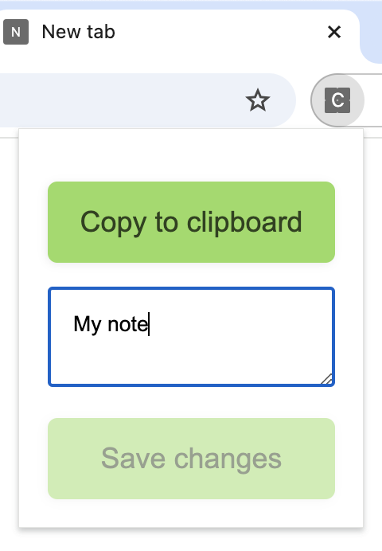

# "Copy-to-clipboard notes manager" Chrome extension

A Chrome extension that lets you manage notes and easily copy those notes into your clipboard.

## Install on Google Chrome

This extension has not been published to the [Chrome Web Store](https://chromewebstore.google.com/) yet.
Currently, you can only install this extension in "developer mode".

## Install in "developer mode"

To work with the code for this Chrome extension, you need to install this extension in "developer mode":

1. [Download](https://github.com/NimJay/copy-to-clipboard-notes-manager-chrome-extension/archive/refs/heads/main.zip) (and unzip) or clone this repository.
1. Install this Chrome extention:
   1. Visit `chrome://extensions` on Google Chrome.
   1. Turn on "Developer mode" using top-right toggle switch.
   1. Click "Load unpacked" and select this `copy-to-clipboard-notes-manager-chrome-extension` folder.
